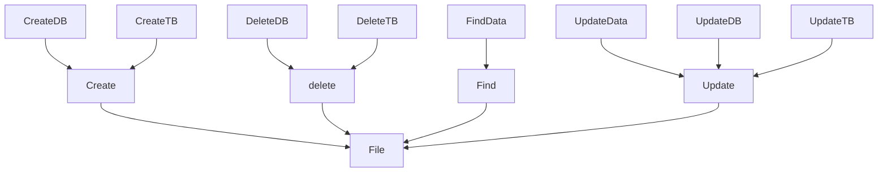

# CasselDB

> This time, wo creare a Databases!

## How to creare a databases?

1. save data
2. read data
3. find data
4. delete data
5. update data
6. that's all!

It's a file system!

## How to create a file?

Different language has different key to create files!

This time, I will using C Plus Plus to realition create file system!

