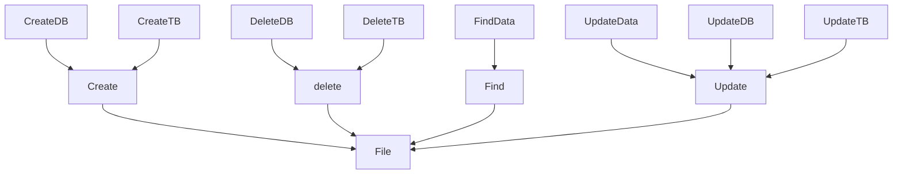
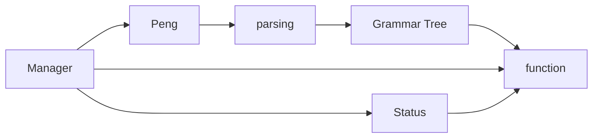

# 详细设计文档

> Cassel DB 详细设计文档

## 功能设计文档

## 函数设计

| 函数功能             | 函数名称 | 参数 | 返回值 | 说明 | 备注 |
| -------------------- | -------- | ---- | ------ | ---- | ---- |
| 数据库存在性校验     |          |      |        |      |      |
| 安装位置             |          |      |        |      |      |
| 校验数据库是否安装   |          |      |        |      |      |
| 校验数据安全         |          |      |        |      |      |
| 获取数据库路径       |          |      |        |      |      |
| 查看所有数据库       |          |      |        |      |      |
| 查看数据库下的数据表 |          |      |        |      |      |
| 创建数据库           |          |      |        |      |      |
| 创建数据表           |          |      |        |      |      |
| 读数据表             |          |      |        |      |      |
| 写数据表             |          |      |        |      |      |
| 操作数据表           |          |      |        |      |      |
| 查询数据             |          |      |        |      |      |
| 添加数据             |          |      |        |      |      |
| 修改数据             |          |      |        |      |      |
| 删除数据             |          |      |        |      |      |

### 功能调度

数据库管理器可以调用Peng 来获取指令，经过语法树解析，可以获取对应的操作方法，然后校验当前状态，通过交验后开始执行。

