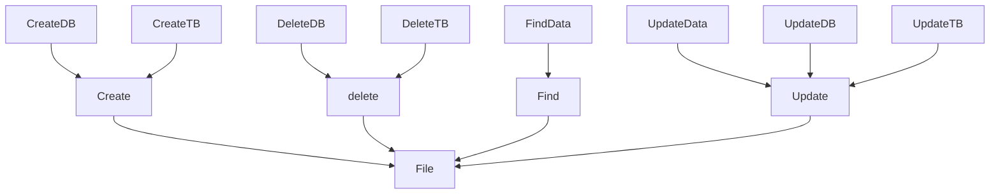
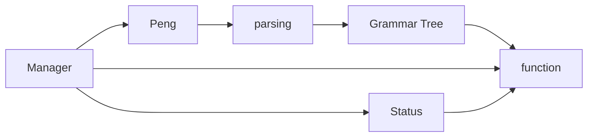

# 详细设计文档

> Cassel DB 详细设计文档

## 功能设计文档

## 函数设计

| 函数功能             | 函数名称 | 参数                                      | 返回值      | 说明 | 备注 |
| -------------------- | -------- | ----------------------------------------- | ----------- | ---- | ---- |
| 数据库存在性校验     |          | db_name:string                            | bool        |      |      |
| 获取数据库安装位置   |          | null                                      | string      |      |      |
| 校验数据库是否安装   |          | install_path:string                       | bool        |      |      |
| 校验数据安全         |          | data_path:string                          | bool        |      |      |
| 获取数据库路径       |          | null                                      | string      |      |      |
| 查看所有数据库       |          | data_path:string                          | list/vector |      |      |
| 查看数据库下的数据表 |          | db_path:string                            | list/vector |      |      |
| 创建数据库           |          | db_name:string                            | bool        |      |      |
| 创建数据表           |          | tb_name:string                            | bool        |      |      |
| 读数据表             |          | db_name:string,tb_name:string             | list/vector |      |      |
| 写数据表             |          | db_name:string,tb_name:string,list/vector | bool        |      |      |
| 操作数据表           |          |                                           |             |      |      |
| 查询数据             |          | key:string,value:string                   | list/vector |      |      |
| 添加数据             |          | data:list/vector                          | bool        |      |      |
| 修改数据             |          | key:string,value:string                   | bool        |      |      |
| 删除数据             |          | key:string,value:string                   | bool        |      |      |

### 功能调度

数据库管理器可以调用Peng 来获取指令，经过语法树解析，可以获取对应的操作方法，然后校验当前状态，通过交验后开始执行。

·

### 数据库存在性校验

1. 获取数据库数据路径
2. 校验数据库数据路径的存在性

### 获取数据库安装位置

1. 获取配置文件
2. 获取数据库安装路径

### 校验数据库是否安装

1. 获取数据库安装路径
2. 校验数据库安装路径的是否存在

### 校验数据安全

### 获取数据库路径

1. 获取配置文件
2. 获取数据库数据路径

### 查看所有数据库

1. 获取数据库路径
2. 查看数据库下的所有文件夹

### 查看数据库下的数据表

1. 获取数据库名称
2. 查看所有数据库
3. 校验数据库是否存在
4. 如果数据库不存在，返回
5. 如果数据库存在，获取数据库文件夹下数据表

### 创建数据库

1. 获取数据库名称
2. 查看所有数据库
3. 校验数据库是否存在
4. 创建数据库
   1. 在数据库数据路径下创建文件夹

### 校验数据库是否存在

1. 获取数据库名称
2. 查看所有数据库
3. 如果被校验的数据库在所有的数据库中，数据库存在
4. 如果被校验的数据库不在所有的数据库中，数据库不存在

### 读数据表

1. 获取数据库名称
2. 获取数据表名称
3. 校验数据库是否存在
4. 校验数据库是否存在
5. 如果数据库存在，而且数据表也存在：
6. 获取数据表的内容

### 写数据表

* 获取数据库名称
* 获取数据表名称
* 校验数据库是否存在
* 校验数据库是否存在
* 如果数据库存在，而且数据表也存在：
* 刷新数据表的内容

### 操作数据表

### 查询数据

1. 获取数据表内容，转为二维列表
2. 查询数据内容

### 添加数据

1. 获取数据表内容，转为二维列表
2. 添加数据内容

### 修改数据

1. 获取数据表内容，转为二维列表
2. 修改数据内容

### 删除数据

1. 获取数据表内容，转为二维列表
2. 删除数据内容
